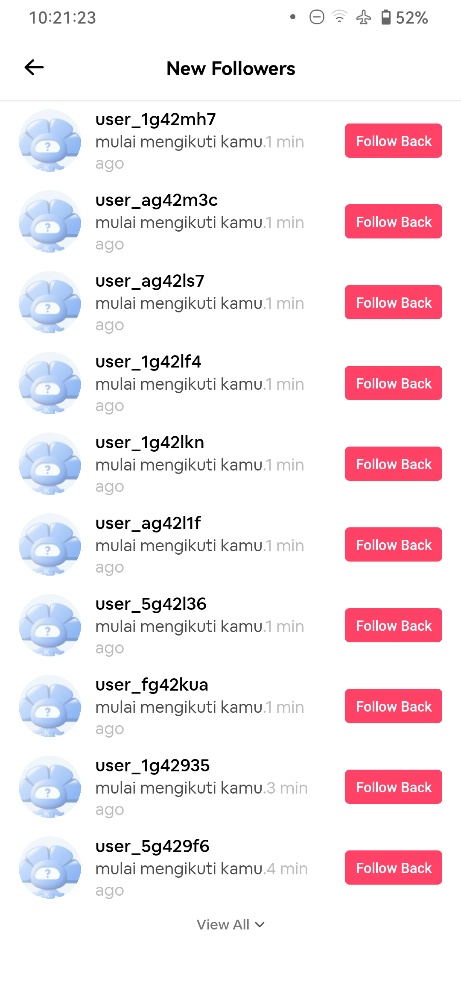

# About

**kipaskipas** is a tool for creating accounts in the **kipaskipas** app and following the target.



---

# Setup

1. **Set your `config.json`:**

   ```json
   {
     "prefixEmail": "bell",
     "targetProfile": "240331",
     "password": "Yupi#123",
     "reffCode": "5ryaqipg"
   }
   ```

2. **Install depedencies**

   ```
   npm i
   ```

3. **Run the tool**
   ```
   node index
   ```
   or
   ```
   npm run dev
   ```
